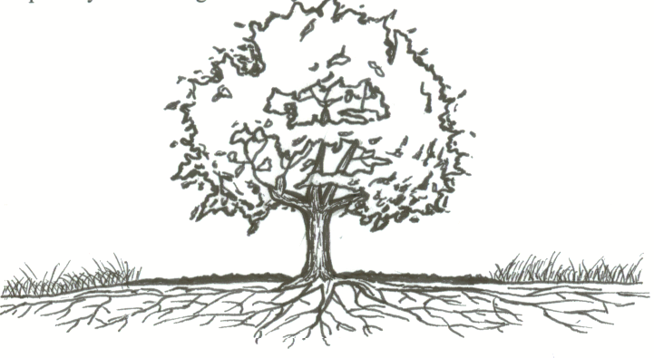

# Developer Developer [Backend]

The Developer Developer [backend] is a FastAPI backend for the Developer Developer tool, designed to help organizations track teams, people, their roles, and skills.

## Future plans

List a roadmap or future plans for the repo work.

- [ ] Implement CRUD endpoints for all data models (User, Skill, Role, Person, PersonSkill, PersonSkillHistory, Team, TeamPerson, SkillTool)
- [ ] Integrate with a persistent database (e.g., PostgreSQL)
- [ ] Add authentication and authorization
- [ ] Create endpoints for analytics and team skill reporting
- [ ] Write comprehensive tests for all endpoints
- [ ] Add API documentation using OpenAPI/Swagger [automatically handled by FastAPI]

## Important disclaimer

This project is in an early stage of development and is not production-ready. Major features, including full CRUD endpoints, persistent database integration, authentication, and comprehensive testing, are not yet implemented. Use at your own risk. The API, data models, and overall functionality are subject to significant change as development progresses.

## Getting Started

1. Make sure you have Python 3.8 or later installed.
2. Install dependencies using requirements.txt:
    ```bash
    pip install -r requirements.txt
    ```
3. Run the development server:
    ```bash
    fastapi dev src/main.py
    ```
4. Visit [http://127.0.0.1:8000/](http://127.0.0.1:8000/) to check the root endpoint.


---

## Prerequisites

- Python 3.8 or above
- pip

---
## Installing

Clone the repo and install dependencies:

```bash
git clone https://github.com/ErikPohl444/Develop_backend.git
cd Develop_backend
pip install -r requirements.txt
```
---
## Running the tests

Currently, there are no tests implemented. In the future, tests will be added using pytest.

---
## Technologies used

List the technologies used here.

- Python
- FastAPI
- Pydantic

## Minimum system requirements

- Python 3.8+
- Works on Windows, macOS, and Linux

## Contributing

I invite contributions.  See the [Contribution Guidelines](CONTRIBUTING.md) for any guidelines.

## Authors

See the [Authors doc.](AUTHORS.md)

## License

This project is licensed under the MIT License - see the [LICENSE](LICENSE) file for details.

## Acknowledgments

* Thanks to everyone who has motivated me to learn more.
* These folks were key to this particular effort: [ACKNOWLEDGEMENTS](ACKNOWLEDGEMENTS.md)

---